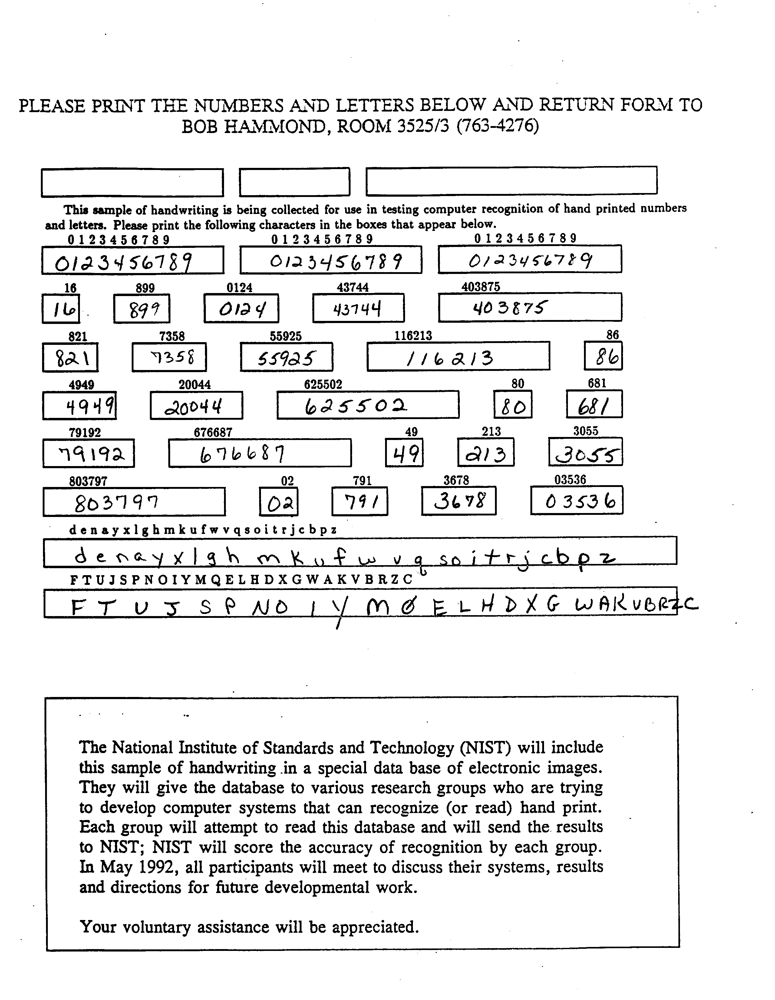

# Overview

Motivations: 

- It was interesting to see what the US goverment was doing in late 80's early 90's - they were thinking 15 years out!
- I could not find any free libraries [in any language] that could read the Group 4 encoded MIS files and exports of the HSF pages.
  - I assumed that compiling the NIST provided C code for the group 4 decoder code provided in their cdrom distro would not be that bad.
	- My assumption was correct. Register keyword deprecation and 16bit to 64 bit sorts of issues.
- Curious how long it would take in 2024 to process this dataset -- and wondering how long it took in 1994!

# NIST Special Database 19 - History 

https://www.nist.gov/srd/nist-special-database-19

- First edition 1995
- Second edition 2016
- 814,255 processed characters in the data set
- Raw Source MIS Characters are 128x128 at 1bpp encoded using GROUP 4 FACSIMILE [Fax Machine]
  -	[see sd19/grp4decomp.cpp](sd19/grp4decomp.cpp)
- 62 character classes 
  - [a-z]
  - [A-Z]
  - [0-9]

Compare the original SD19 dataset to its derivatives:

https://en.wikipedia.org/wiki/MNIST_database

- 60k train + 10k tesst
- Dataset has been ported to many different data science packages.

https://www.itl.nist.gov/iaui/vip/cs_links/EMNIST/Readme.txt

- 814,255 characters. 62 unbalanced classes.
- EMNIST Balanced:  131,600 characters. 47 balanced classes.
- Same IHEAD and MIS format - just another shuffle of the sd19

## Acronymns

- HSF - Handwriting Sample Form
- MIS - Multiple Isolated Character Images
- PCT - File with an IHEAD that contains one complete HSF form
- CLS - Manually checked list of characters prsent inside the MIS file

# Handwriting Sample Form [HSF] 

**Example**: 

- Sample Form #8
- Writer # 4164
- Template #10
- Created: Fri Apr  3 17:25:05 1992
- 2560x3300 pixels @ 1bpp
- 46272 bytes compressed

HSFs were scanned at 11.8 dots per millimeter (300 dots per inch) and contain 34 fields: 

- [Field 0] Person's name - occluded or left incomplete on all HSF images
- [Field 1-2] city/state field. Was never been processed by NIST
- [Field 3-30] 28 digit fields 
- [Field 31] upper-case field
- [Field 32] lower-case field
- [Field 33] and an unconstrained Constitution text paragraph

## Processed Sqlite sd19.db3

- sd19.db3 - 988,839,936 bytes @ __128x128__ MIS characters and all HSF Pages
- sd19.db3 - 849,248,256 bytes @ __32x23 MIS__ characters scaled with norm_2nd_gen2\(\) and all HSF Pages
- 3,668 hsf_page rows [Same As the stated count from NIST]
- 814,255 mis rows [Same As the stated count from NIST]
- db creation around 2 minutes on my desktop - 8 minutes on my laptop
